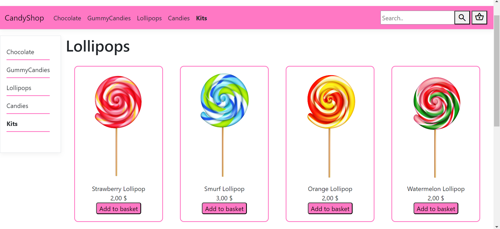
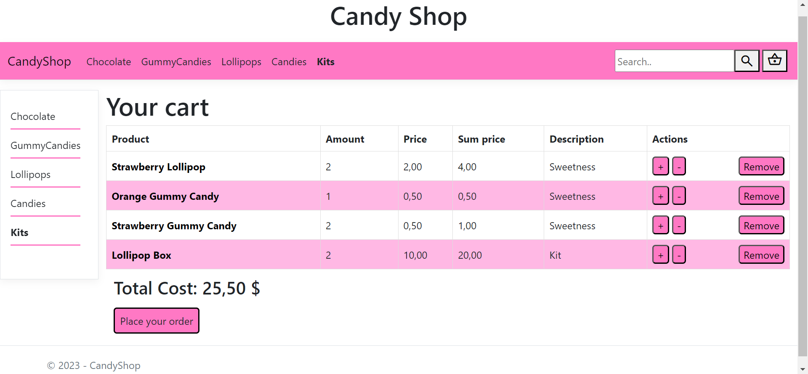
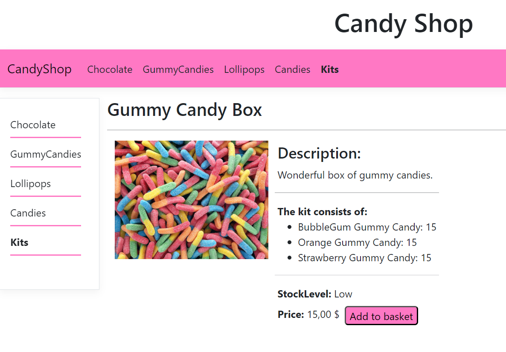

# CandyShop
Web application for online shopping. Application allows users to create orders for selected
products. The application stores user preferences and selected products using cookies. 
Customers can easily search and browse products on the web pages and check details of the products by clicking on them. 
Server communicates with database and saves data there.

## Examples of webiste images:
|                                           |                                            |
| ----------------------------------------- |--------------------------------------------|
| |  |

|                                             |
| ------------------------------------------- |
|  |
